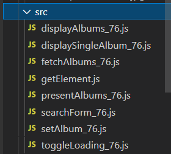
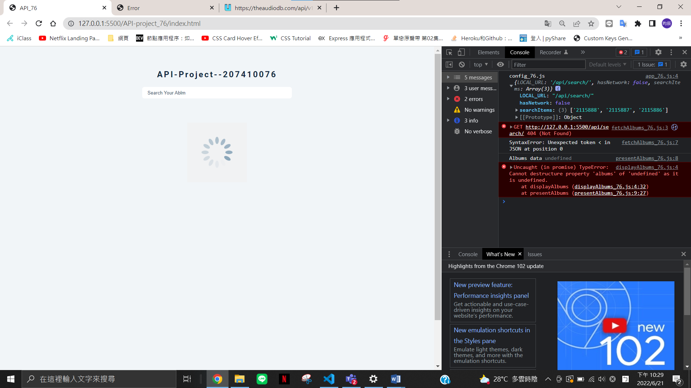
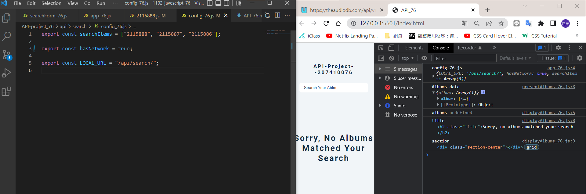
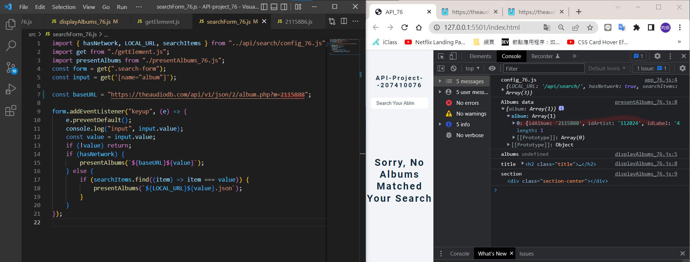
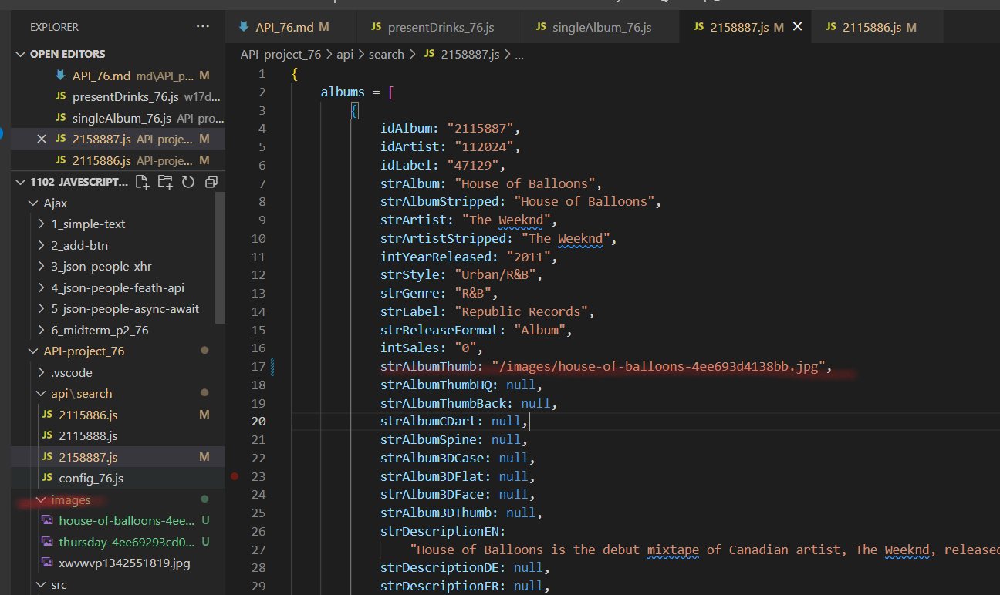

### S1:theme 設計


---

### S2:建立一個 js 檔，將 API DATA 放入


---

### S3:創 src/api/search 中的 3 個 data


---

### S4:改寫老師上課的 demo js



---

### S5:確認有抓到 data 出現 config_76.js



---

### S6:還是抓不到 api 資料，但有出現無此搜尋



---

### S7: console.log 有抓到 data



---

### S8: local 讀取，下載圖片，並改根目錄



---

### 自主學習

### A1 設置一個 Loading 的 gif，找到一個網站可以自己創立

https://loading.io/?ref=techmoon

---

### 解決問題

1. console 一直爆錯,後來發現要獨立開啟 folder，因為有根目錄的問題

---

### last log


```
$ git log --pretty=format:"%h%x09%an%x09%ad%x09%s" --after="2022-06-20"
f0fb7dc chen945 Tue Jun 21 23:11:37 2022 +0800  S8: local 讀取，下載圖片，並改根目錄
f97babc chen945 Tue Jun 21 23:06:22 2022 +0800  S7: console.log 有抓到 data
8cd41c7 chen945 Tue Jun 21 22:31:20 2022 +0800  S5:確認有抓到 data 出現 config_76.js
f5ccc9a chen945 Tue Jun 21 22:26:47 2022 +0800  S4:改寫老師上課的 demo js
b172c5a chen945 Tue Jun 21 22:24:54 2022 +0800  S3:創 src/api/search 中的 3 個 data
086f046 chen945 Tue Jun 21 17:42:18 2022 +0800  S2:建立一個js檔(API DATA)
b58c9bb chen945 Tue Jun 21 17:38:35 2022 +0800  自主學習A1-自己設立loading的gif(網站資訊)
2fb1312 chen945 Tue Jun 21 17:35:16 2022 +0800  API-theme
bf25a2b chen945 Tue Jun 21 17:10:27 2022 +0800  w17 last log & pdf
234a7b6 chen945 Tue Jun 21 17:07:37 2022 +0800   w17-p4: do Week 4 classdemo for menu theme
337cad7 chen945 Tue Jun 21 16:02:27 2022 +0800  ### w17-p3: search items that is available in searchItems array
6137b61 chen945 Tue Jun 21 15:51:58 2022 +0800  w17-p2: fetch a local json data with local images
7601cf0 chen945 Tue Jun 21 15:34:40 2022 +0800  ### w17-p1: fetch local json data when hasNetwork=false
```
