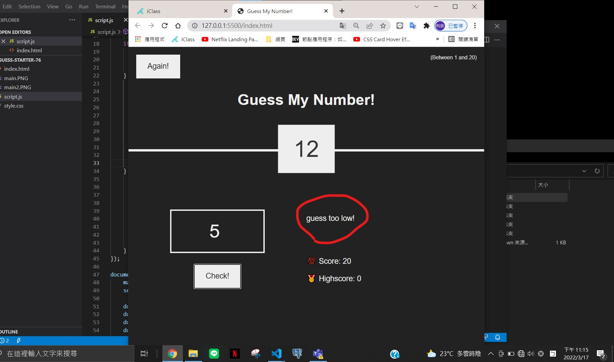

### p1 -- guess low



### p2 -- guess high


### p3 -- Correct number


### p4 -- JS_CODE

```
'use strict';

let secretNumber = Math.trunc(Math.random()*20)+1; //設定亂數
let min = 0;  //設定最小值
let max = 20; //設定最大值

document.querySelector('.number').textContent = secretNumber;

const displayMessage = function (message) {
    document.querySelector('.message').textContent = message;
}

//點選check
document.querySelector('.check').addEventListener('click', function(){
    const guess = Number(document.querySelector('.guess').value);

    //若guess是空值則會跳出no number
    if(!guess){
        displayMessage('No number!');

        //猜測的值=亂數的值
    } else if ( guess === secretNumber ) {
        displayMessage('Correct number!'); //跳出的訊息為Correct number!
        document.querySelector('.number').textContent = secretNumber;
        document.querySelector('body').style.backgroundColor = '#60b347'; //設定顏色
        document.querySelector('.number').style.width = '30rem'; //設定字大小


        if(max > min) {
            min = max;
            document.querySelector('.min').textContent = min;
        }

    } else if ( guess !== secretNumber) {
        if(max > 1) {
            displayMessage( guess > secretNumber ? 'guess too high!' : 'guess too low!');
            max--;
            document.querySelector('.max').textContent = max;
        } else {
            displayMessage('You lost the game!');
            document.querySelector('.max').textContent = 0;
        }

    }
});

document.querySelector('.again').addEventListener('click', function () {
    max = 20;
    secretNumber = Math.trunc(Math.random() * 20) + 1;

    document.querySelector('.message').textContent = 'Start guessing...';
    document.querySelector('.max').textContent = max;
    document.querySelector('.number').textContent = '?';
    document.querySelector('.guess').value = '';
    document.querySelector('body').style.backgroundColor = '#222';
    document.querySelector('.number').style.width = '15rem';
  });

```
