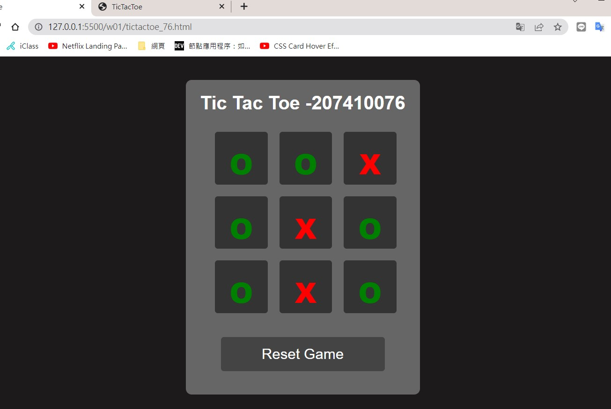
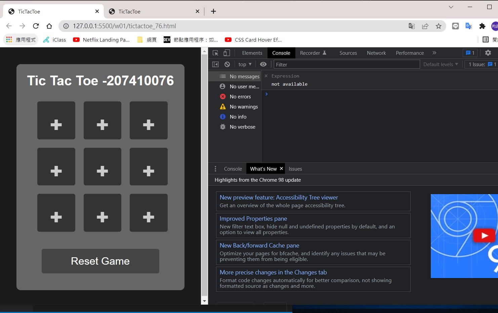
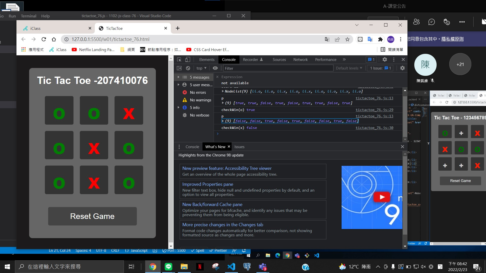
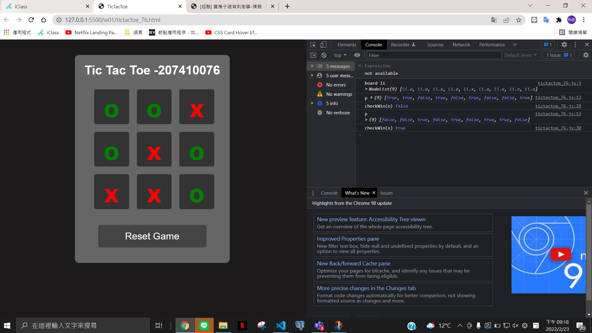

####P1 顯示OX



####P1-2 Reset Game




####P2 確認winplayer







####JS程式碼
```
const resetBtn = document.querySelector('#reset')

//console.log('resetBtn', resetBtn)
const allLi = document.querySelectorAll('#board li')
console.log('board li', allLi)

const checkWin = (player) => {
  let p = []
  allLi.forEach((li) => {
    p.push(li.classList.contains(player))
  })

  console.log('p', p)
  const [p1, p2, p3, p4, p5, p6, p7, p8, p9] = p

  if (
    (p1 && p2 && p3) ||
    (p4 && p5 && p6) ||
    (p7 && p8 && p9) ||
    (p1 && p4 && p7) ||
    (p2 && p5 && p8) ||
    (p3 && p6 && p9) ||
    (p1 && p5 && p9) ||
    (p3 && p5 && p7)
  )
    return true
  else return false
}
console.log('checkWin(o)', checkWin('o'))
console.log('checkWin(x)', checkWin('x'))

const reset = () => {
  allLi.forEach((li) => {
    li.textContent = '+'
    li.classList = ''
  })
}
//監聽 addEventListener
resetBtn.addEventListener('click', reset)

```