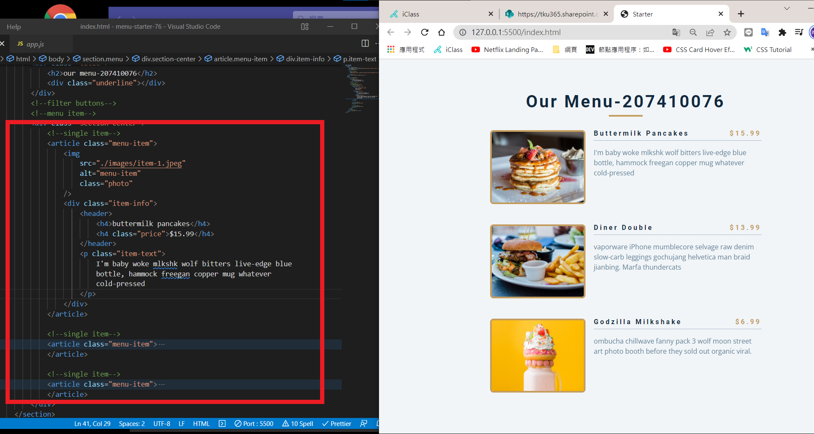
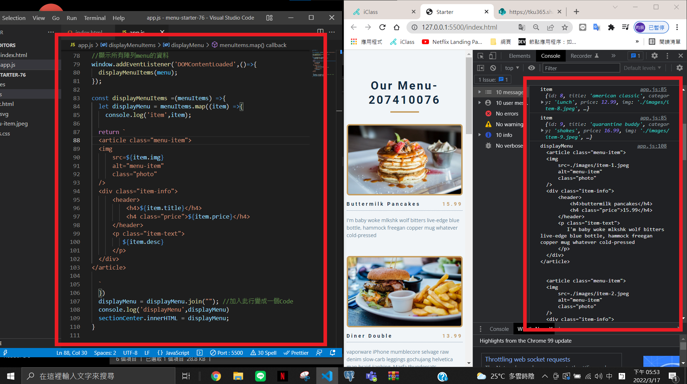
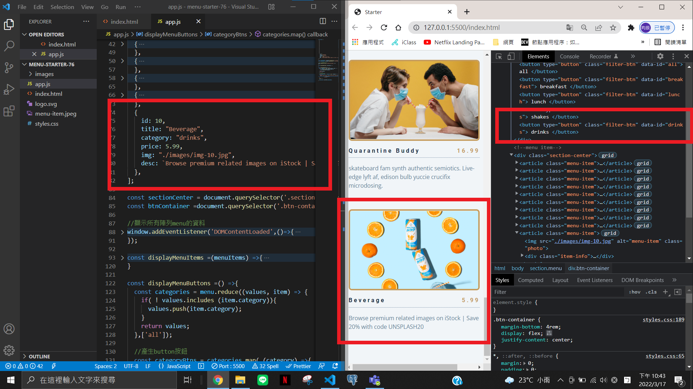
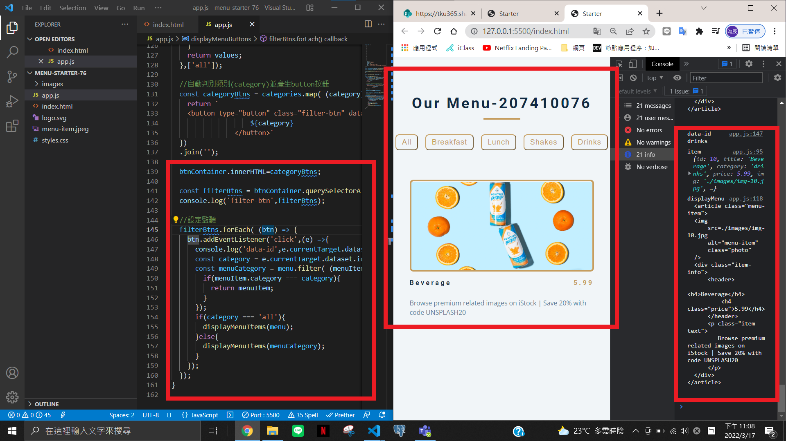

### P1:create theme for menu-item

### P2: displayMenu with 9 items

### P3: displayMenuButtons and add one new menu item with different category

### P4: make filter function works, test with the newly added item

