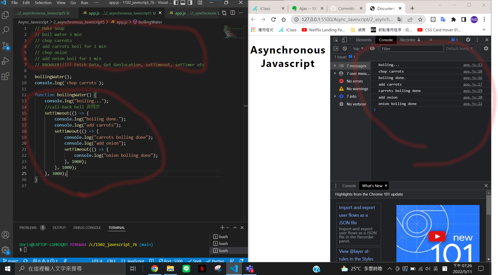
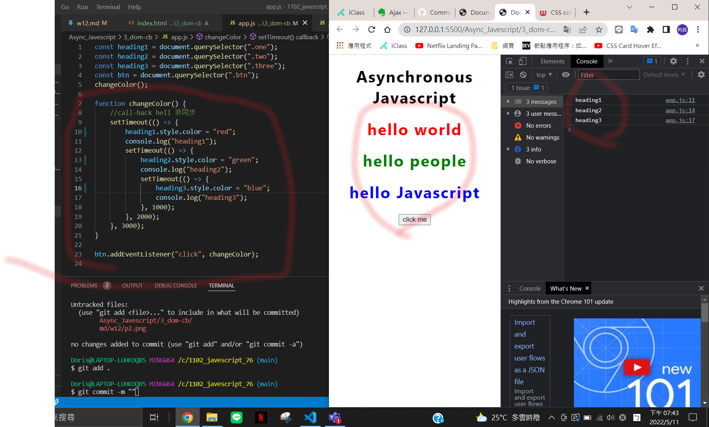
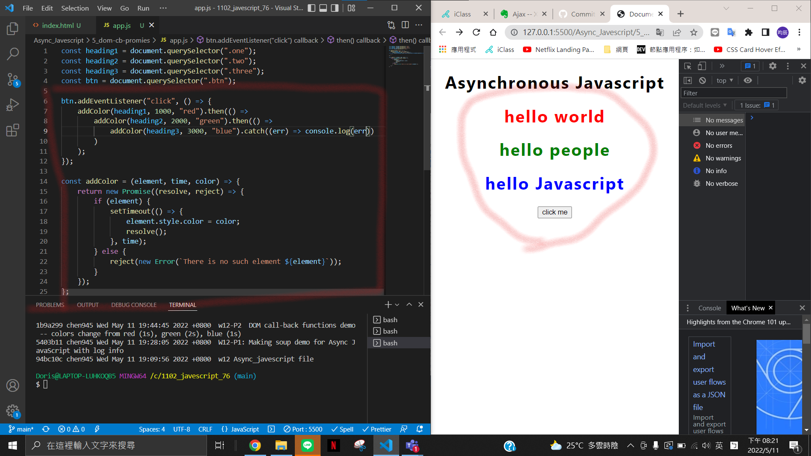
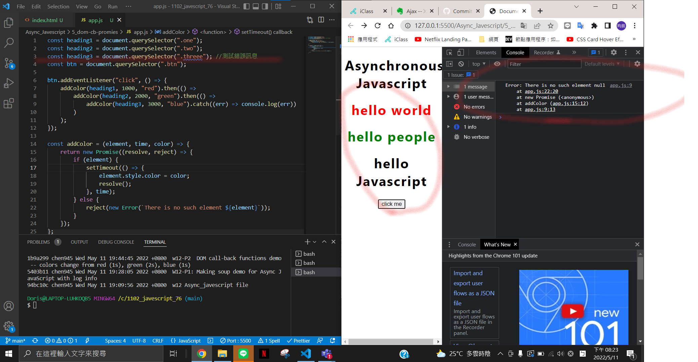
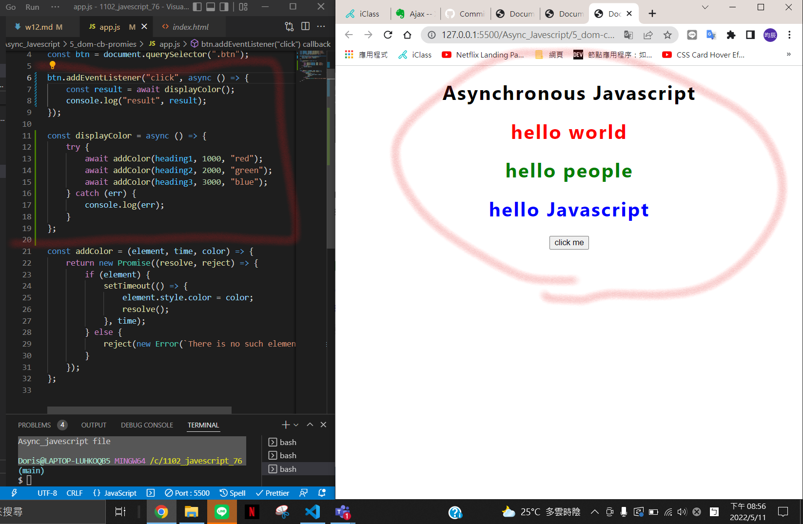
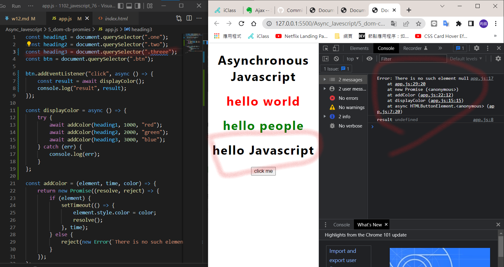
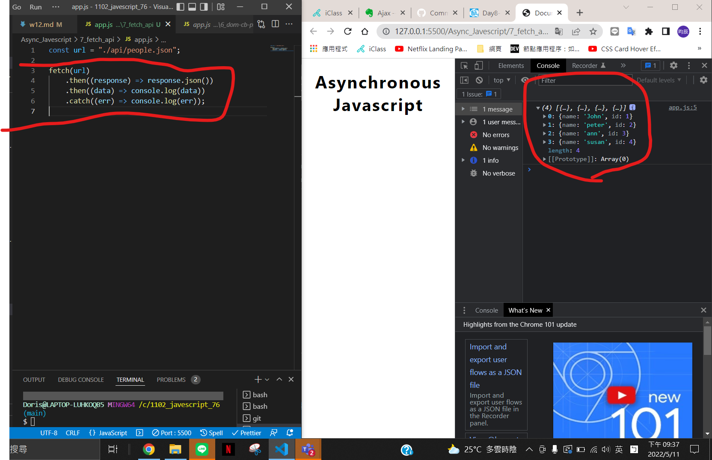
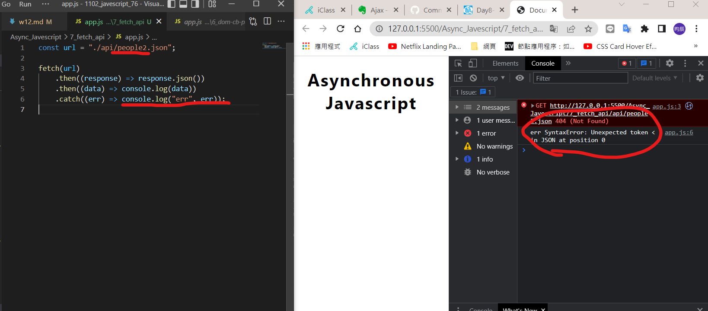
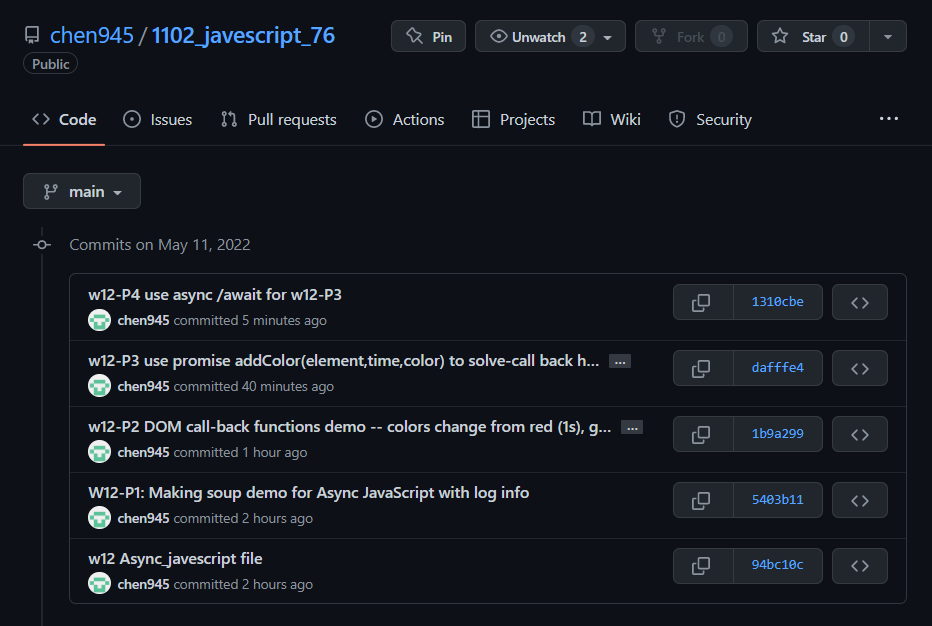

### Github-repo url

https://github.com/chen945/1102_javescript_76

### W12-P1: Making soup demo for Async JavaScript with log info



### w12-P2 DOM call-back functions demo -- colors change from red (1s), green (2s), blue (1s)



### w12-P3 use promise addColor(element,time,color) to solve-call back hell in w12-P2


---測試錯誤訊息


### w12-P4 use async /await for w12-P3


---測試錯誤訊息


### w12-P5 fetch people.json with 4 data shown on console, change name to people2.json will result in error


---測試錯誤訊息


### log 紀錄



```
$ git log --pretty=format:"%h%x09%an%x09%ad%x09%s" --after="2022-05-10"
1310cbe chen945 Wed May 11 21:02:56 2022 +0800 w12-P4 use async /await for w12-P3
dafffe4 chen945 Wed May 11 20:28:43 2022 +0800 w12-P3 use promise addColor(element,time,color) to solve-call back hell in w12-P2
1b9a299 chen945 Wed May 11 19:44:45 2022 +0800 w12-P2 DOM call-back functions demo -- colors change from red (1s), green (2s), blue (1s)
5403b11 chen945 Wed May 11 19:28:05 2022 +0800 W12-P1: Making soup demo for Async JavaScript with log info
94bc10c chen945 Wed May 11 19:09:56 2022 +0800 w12 Async_javescript file
```
