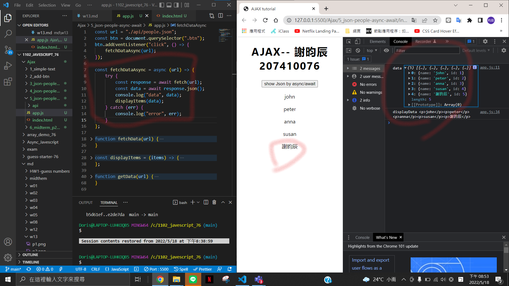
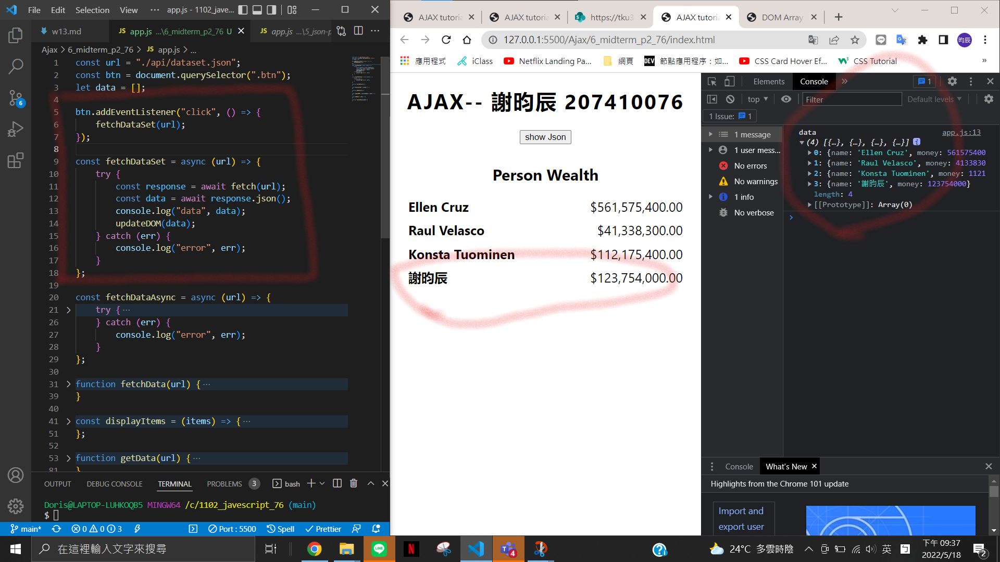
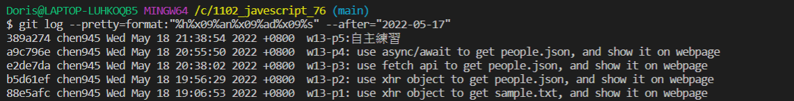

### Github-repo url

https://github.com/chen945/1102_javescript_76

### w13-p1: use xhr object to get sample.txt, and show it on webpage


### w13-p2: use xhr object to get people.json, and show it on webpage


### w13-p3: use fetch api to get people.json, and show it on webpage


### w13-p4: use async/await to get people.json, and show it on webpage



### w13-p5:自主練習



### Log



```
$ git log --pretty=format:"%h%x09%an%x09%ad%x09%s" --after="2022-05-17"
389a274 chen945 Wed May 18 21:38:54 2022 +0800  w13-p5:自主練習
a9c796e chen945 Wed May 18 20:55:50 2022 +0800  w13-p4: use async/await to get people.json, and show it on webpage
e2de7da chen945 Wed May 18 20:38:02 2022 +0800  w13-p3: use fetch api to get people.json, and show it on webpage
b5d61ef chen945 Wed May 18 19:56:29 2022 +0800  w13-p2: use xhr object to get people.json, and show it on webpage
88e5afc chen945 Wed May 18 19:06:53 2022 +0800  w13-p1: use xhr object to get sample.txt, and show it on webpage
```
