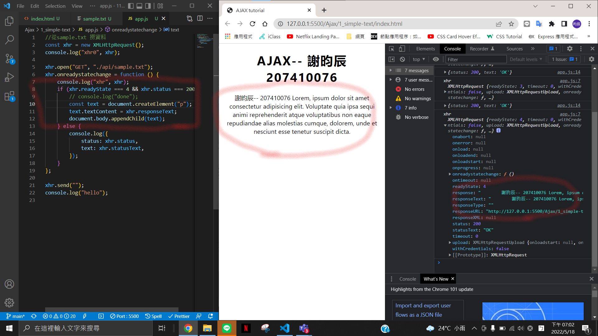
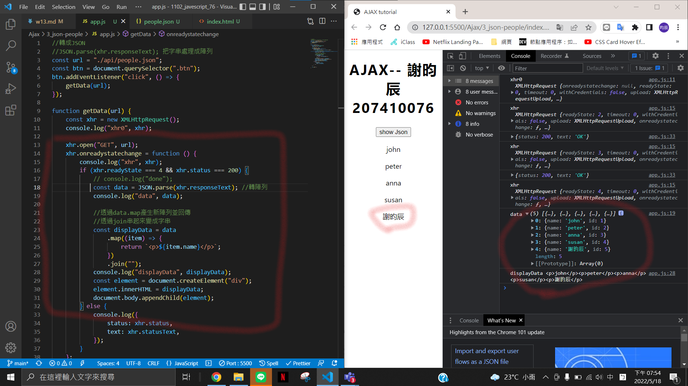
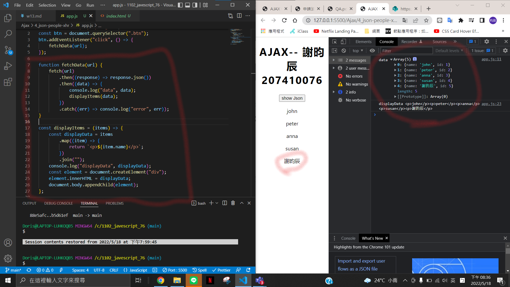

### Github-repo url

https://github.com/chen945/1102_javescript_76

### w13-p1: use xhr object to get sample.txt, and show it on webpage

### w13-p2: use xhr object to get people.json, and show it on webpage

### w13-p3: use fetch api to get people.json, and show it on webpage

### Log 指令

git log --pretty=format:"%h%x09%an%x09%ad%x09%s" --after="2022-05-18"
