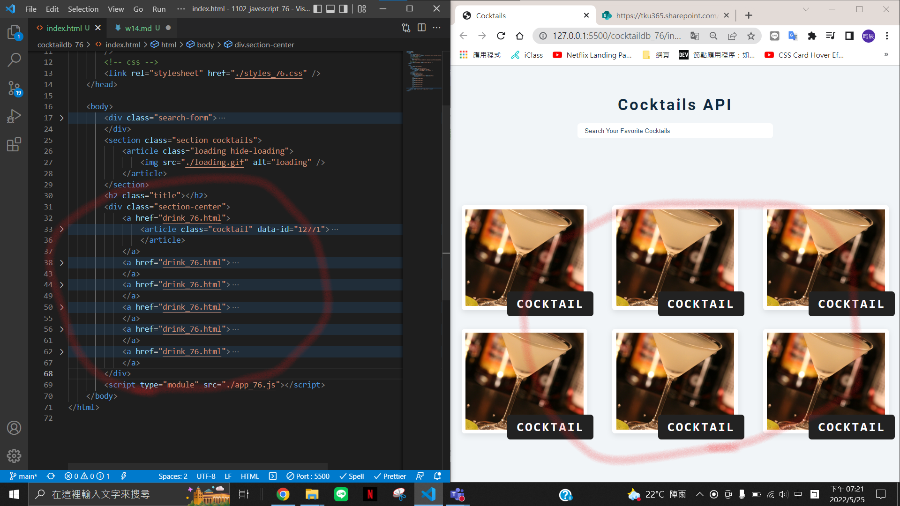

### GITHUB URL

https://github.com/chen945/1102_javescript_76

### w14-p1: use create html themne for Cocktail API demo



### w14-p2: fetch data from given url


### w14-p3: fetch drinks, get null, show no drinks matched


### w14-p4: fetch drinks from given url, and display all drinks


### w13-p5-1: let loading.gif show first, remove loading.gif if no drinks matched


### w13-p5-2: let loading.gif show first, remove loading.gif in order to show all drinks


### Log


```
$ git log --pretty=format:"%h%x09%an%x09%ad%x09%s" --after="2022-05-24"
ec1c206 chen945 Wed May 25 21:36:28 2022 +0800  w13-p5-2: let loading.gif show first, remove loading.gif in order to show all drinks
6d0d518 chen945 Wed May 25 21:33:13 2022 +0800  w13-p5-1: let loading.gif show first, remove loading.gif if no drinks matched
f0d9d07 chen945 Wed May 25 21:11:12 2022 +0800  w14-p4: fetch drinks from given url, and display all drinks
31893b4 chen945 Wed May 25 20:52:40 2022 +0800  w14-p3: fetch drinks, get null, show no drinks matched
ab91b16 chen945 Wed May 25 20:22:53 2022 +0800  w14-p2: fetch data from given url
4335c8a chen945 Wed May 25 19:23:08 2022 +0800  w14-p1: use create html themne for Cocktail API demo
```
