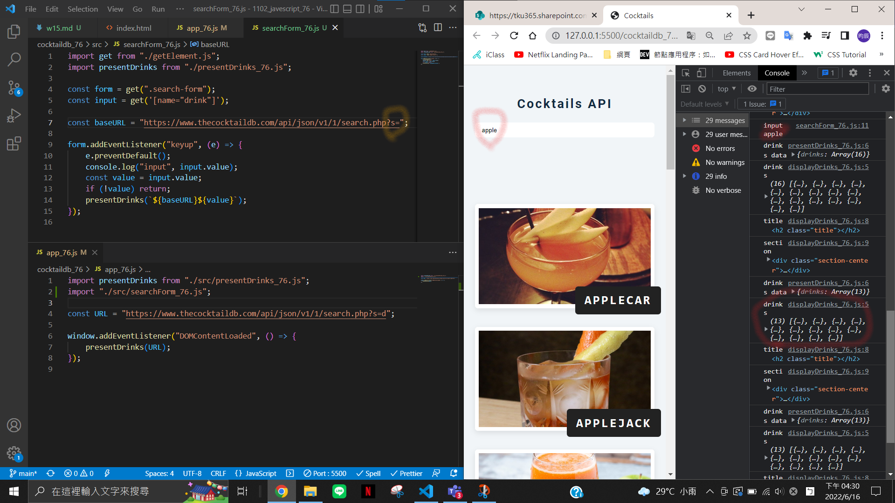
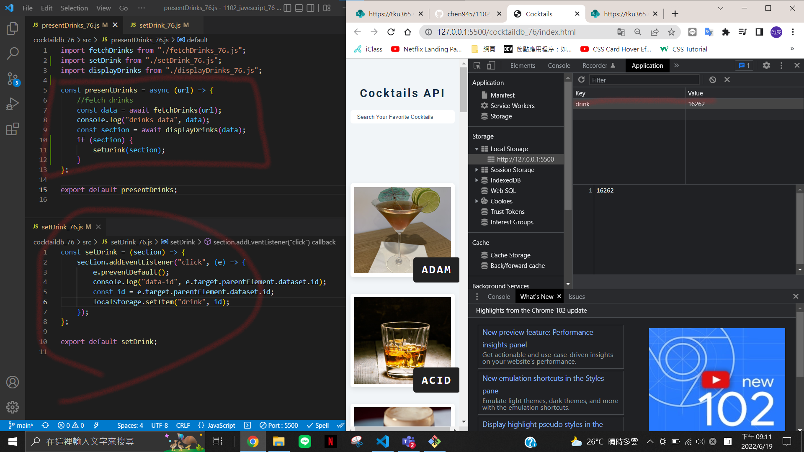
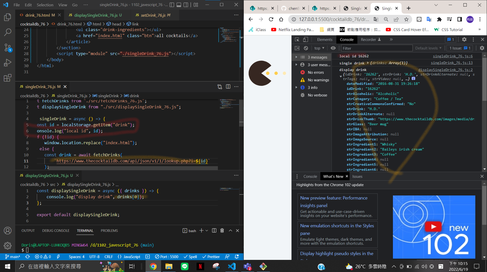

### w15-p1: finish search form

### w15-p2: Get data-id of a drink, save to local storage

### w15-p3: Get drink info based on data-id, and show the data

###

`git log --pretty=format:"%h%x09%an%x09%ad%x09%s" --after="2022-05-31"`
