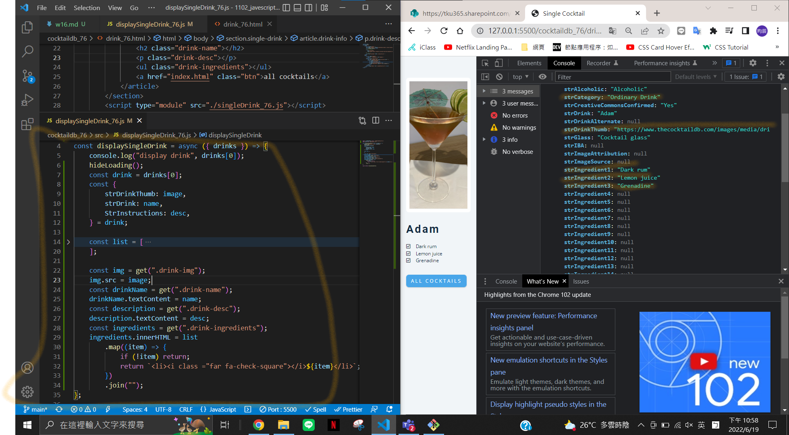

### w16-p1: finish displaySingleDrink_xx.js



### w16-p2: finish addItems for Grocery demo


### last log


```
$ git log --pretty=format:"%h%x09%an%x09%ad%x09%s" --after="2022-06-18"
f6c37a9 chen945 Sun Jun 19 23:49:32 2022 +0800  w16-p2: finish addItems for Grocery demo
2cc71d6 chen945 Sun Jun 19 23:00:17 2022 +0800  w16-p1: finish displaySingleDrink_xx.js
f16da13 chen945 Sun Jun 19 22:21:50 2022 +0800  w15 last log & pdf
134c5b3 chen945 Sun Jun 19 22:18:36 2022 +0800  w15-p3: Get drink info based on data-id, and show the data
6ee12d5 chen945 Sun Jun 19 21:13:24 2022 +0800  w15-p2: Get data-id of a drink, save to local storage
```
