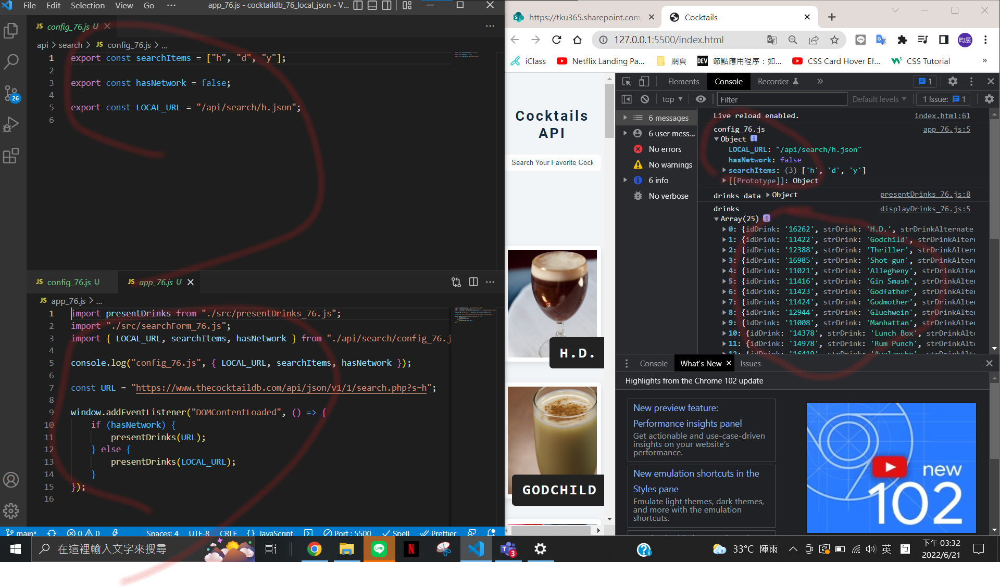
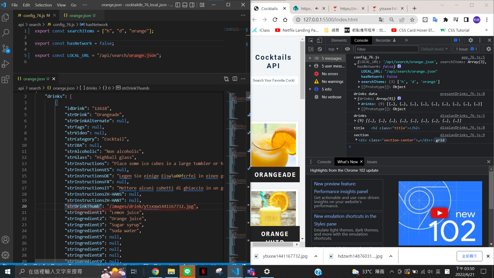
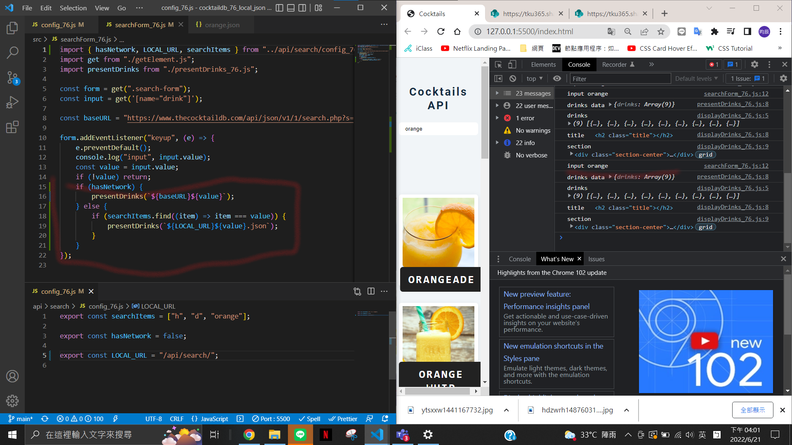
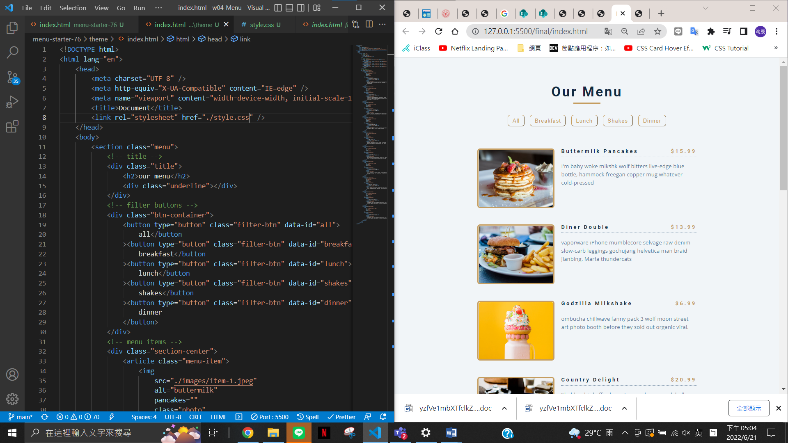

### w17-p1: fetch local json data when hasNetwork=false



### w17-p2: fetch a local json data with local images



### w17-p3: search items that is available in searchItems array



### w17-p4: do Week 4 classdemo for menu theme



### last log


```
$ git log --pretty=format:"%h%x09%an%x09%ad%x09%s" --after="2022-06-20"
234a7b6 chen945 Tue Jun 21 17:07:37 2022 +0800   w17-p4: do Week 4 classdemo for menu theme
337cad7 chen945 Tue Jun 21 16:02:27 2022 +0800  ### w17-p3: search items that is available in searchItems array
6137b61 chen945 Tue Jun 21 15:51:58 2022 +0800  w17-p2: fetch a local json data with local images
7601cf0 chen945 Tue Jun 21 15:34:40 2022 +0800  ### w17-p1: fetch local json data when hasNetwork=false
```
